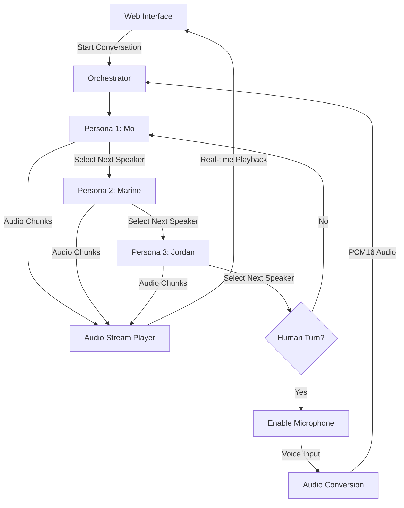

# 🎙️ Modcast

<p align="center">
  
</p>

<p align="center">
  <strong>AI-Powered Podcast Platform with Mo & Friends</strong>
</p>

A cutting-edge system for orchestrating multi-persona AI podcast conversations using OpenAI's Realtime API with seamless audio streaming and dynamic speaker selection.

## 🌟 Key Features

- **Real-time Audio Streaming**: Experience natural conversations with minimal latency using OpenAI's Realtime WebSocket API
- **Multi-Persona Orchestration**: Coordinate multiple AI personas with distinct personalities, voices, and conversation styles
- **Dynamic Speaker Selection**: AI personas intelligently choose who speaks next for natural conversation flow
- **Human Interaction**: Jump into the conversation at any time with voice input
- **Web Interface**: Beautiful, responsive UI for monitoring and participating in conversations
- **Optimized Performance**: Sub-second transitions between speakers with chunk-based audio streaming

## 🚀 Why This Project?

Traditional AI conversations suffer from:
- Long delays between speakers
- Unnatural turn-taking
- Limited multi-agent coordination
- Poor audio streaming performance

This orchestrator solves these problems by:
- **Streaming audio chunks** as they're generated (no waiting for complete responses)
- **Intelligent speaker selection** using function calling
- **Parallel processing** of audio generation and playback
- **Seamless human integration** with real-time voice input

## 📋 Prerequisites

- Python 3.8+
- OpenAI API key with access to Realtime API
- FFmpeg (for audio conversion)
- Modern web browser with microphone access

## 🛠️ Installation

1. **Clone the repository**
   ```bash
   git clone <repository-url>
   cd modcast
   ```

2. **Create virtual environment**
   ```bash
   python -m venv venv
   source venv/bin/activate  # On Windows: venv\Scripts\activate
   ```

3. **Install dependencies**
   ```bash
   pip install -r requirements.txt
   ```

4. **Install FFmpeg**
   - **Ubuntu/Debian**: `sudo apt-get install ffmpeg`
   - **macOS**: `brew install ffmpeg`
   - **Windows**: Download from [ffmpeg.org](https://ffmpeg.org/download.html)

5. **Set up environment variables**
   ```bash
   cp env.example .env
   # Edit .env and add your OpenAI API key
   ```

## 🎯 Quick Start

> 📖 **New to the project?** Check out our [Quick Start Guide](docs/QUICKSTART.md) for detailed setup instructions!

1. **Start the orchestrator**
   ```bash
   cd examples
   python web_demo.py
   ```

2. **Open your browser**
   Navigate to `http://localhost:3001`

3. **Start a conversation**
   Click "🚀 Start Real-time Conversation" and watch the AI personas interact!

## 🏗️ Architecture

> 📐 **Want to understand how it works?** Read our comprehensive [Architecture Guide](docs/ARCHITECTURE.md)!

### System Flow



### Core Components

1. **SimpleOrchestrator** (`simple_orchestrator.py`)
   - Manages persona lifecycle and turn-taking
   - Handles WebSocket connections to OpenAI Realtime API
   - Implements dynamic speaker selection via function calling
   - Tracks audio chunks for precise timing

2. **Web Interface** (`orchestrator_test.py`)
   - Flask + SocketIO for real-time communication
   - Audio streaming and playback management
   - Microphone input handling
   - Beautiful, responsive UI

3. **Audio Management**
   - Chunk-based streaming (430ms per chunk)
   - PCM16 to WAV conversion for browser compatibility
   - Precise timing calculations for seamless transitions

## 🎨 Customization

### Adding New Personas

Edit the personas in `examples/web_demo.py`:

```python
personas = [
    PersonaConfig(
        name="YourPersona",
        voice="alloy",  # OpenAI voice options
        instructions="Your persona's personality and behavior...",
        temperature=0.8,
        max_response_tokens=1500
    ),
    # Add more personas...
]
```

### Adjusting Timing

Modify chunk duration in `simple_orchestrator.py`:

```python
self.audio_chunk_manager = AudioChunkManager(
    chunk_duration_ms=430  # Adjust for faster/slower transitions
)
```

### Conversation Topics

Change the initial topic in `examples/web_demo.py`:

```python
loop.run_until_complete(orchestrator.start_conversation_async(
    "Your custom conversation starter..."
))
```

## 📊 Performance Metrics

- **Audio Latency**: < 500ms between speakers
- **Chunk Size**: ~430ms of audio per chunk
- **Transition Time**: Near-instantaneous with streaming
- **Human Input**: Direct audio passthrough to AI

## 🔧 Advanced Configuration

### Environment Variables

Create a `.env` file:

```env
OPENAI_API_KEY=your-api-key-here
OPENAI_REALTIME_MODEL=gpt-4o-realtime-preview
OPENAI_VOICE=alloy
```

### Voice Options

Available OpenAI voices:
- `alloy` - Neutral and balanced
- `ash` - Warm and friendly  
- `ballad` - Expressive and dramatic
- `coral` - Professional and clear
- `sage` - Wise and thoughtful
- `verse` - Dynamic and energetic

## 🐛 Troubleshooting

### Common Issues

1. **No audio playback**
   - Check browser console for errors
   - Ensure FFmpeg is installed
   - Verify microphone permissions

2. **Connection errors**
   - Verify OpenAI API key
   - Check internet connection
   - Ensure Realtime API access

3. **Slow transitions**
   - Adjust chunk_duration_ms
   - Check network latency
   - Monitor CPU usage

### Debug Mode

Enable detailed logging:

```python
logger.setLevel(logging.DEBUG)
```

## 📚 API Reference

### SimpleOrchestrator

```python
orchestrator = SimpleOrchestrator(personas, openai_config)

# Event handlers
orchestrator.on_persona_started = lambda name: ...
orchestrator.on_persona_finished = lambda name, text, audio: ...
orchestrator.on_conversation_complete = lambda: ...
orchestrator.on_audio_chunk = lambda speaker, chunk: ...

# Control methods
await orchestrator.start_conversation_async(initial_topic)
orchestrator.stop_conversation()
orchestrator.add_human_audio(audio_bytes)
```

### Web Endpoints

- `GET /` - Main web interface
- `POST /start_orchestrator` - Begin conversation
- `POST /stop_orchestrator` - End conversation
- `POST /human_audio` - Submit voice input
- `GET /status` - Get conversation status

## 🤝 Contributing

1. Fork the repository
2. Create a feature branch
3. Make your changes
4. Submit a pull request

## 📁 Project Structure

See our [Project Structure Guide](docs/PROJECT_STRUCTURE.md) for a detailed overview of the codebase organization.

```
modcast/
├── src/                 # Core library code
├── examples/            # Example implementations  
├── docs/                # Documentation
└── requirements.txt     # Dependencies
```

## 📄 License

This project is licensed under the MIT License - see the LICENSE file for details.

## 🙏 Acknowledgments

- OpenAI for the Realtime API
- Flask and SocketIO communities
- Contributors and testers

---

Built with ❤️ by Mo and the Modcast team for seamless AI podcast conversations