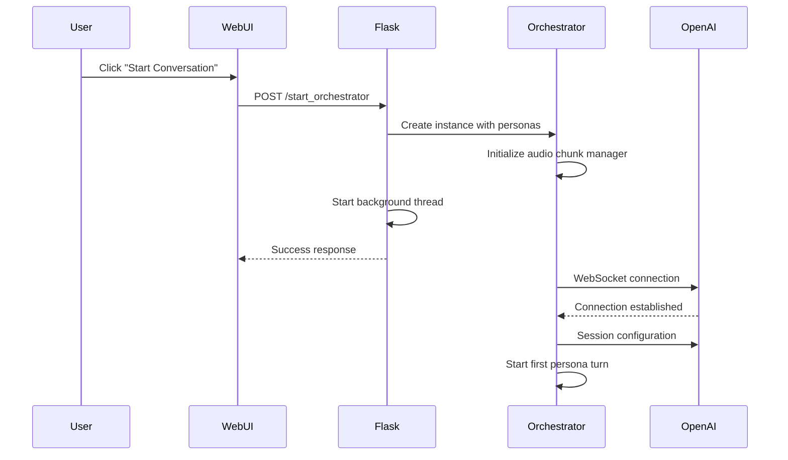
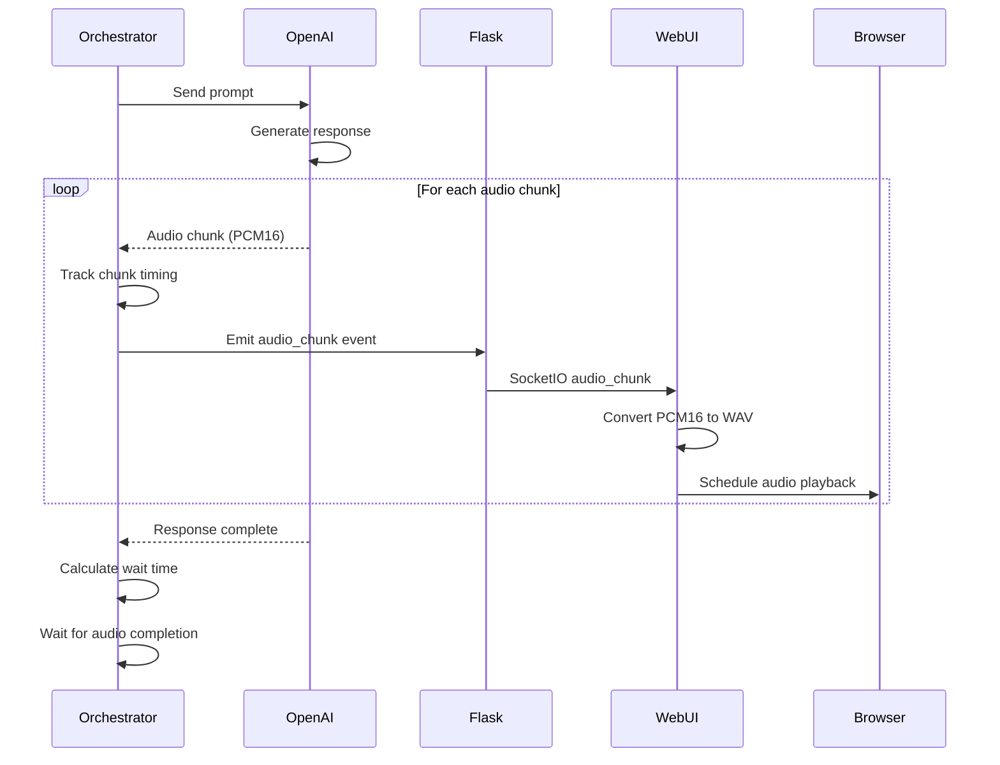
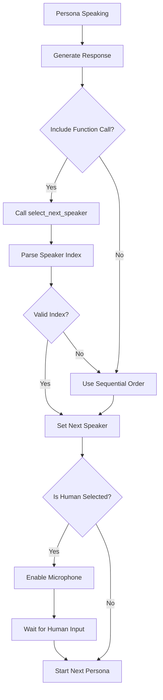
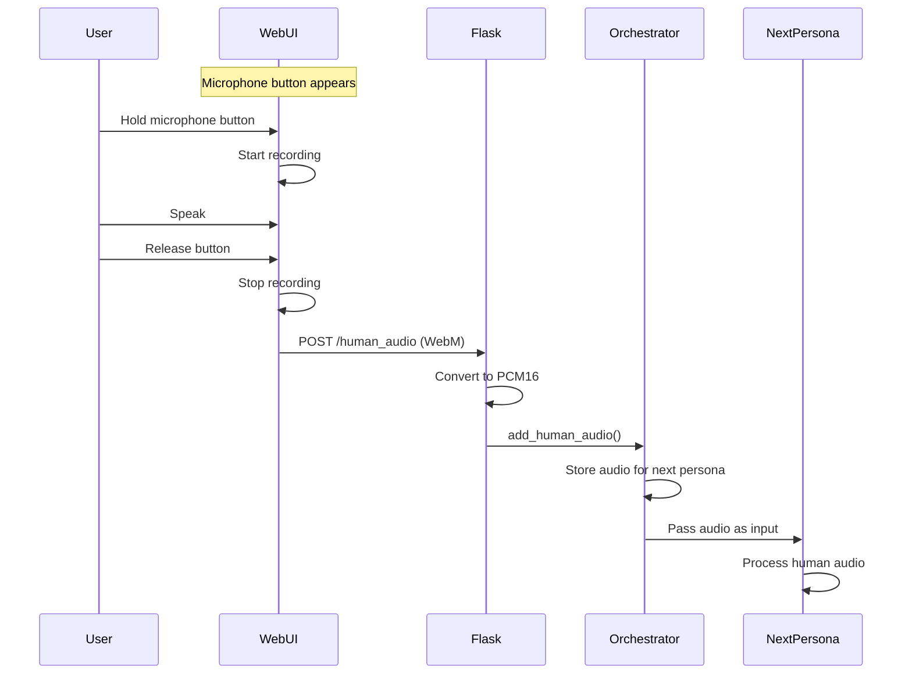

# 🏗️ Modcast Architecture

<p align="center">
  
</p>

## Overview

Modcast is a sophisticated AI podcast platform that manages multi-persona conversations with seamless audio streaming and dynamic speaker selection. This document provides a detailed technical overview of the system architecture.

## System Components

### 1. Core Orchestrator (`src/simple_orchestrator.py`)

The heart of the system, responsible for:
- Managing persona lifecycle
- WebSocket communication with OpenAI Realtime API
- Audio chunk tracking and timing
- Dynamic speaker selection
- Human interaction handling

### 2. Web Interface (`examples/web_demo.py`)

A Flask-based web application providing:
- Real-time UI updates via SocketIO
- Audio streaming to browser
- Microphone input capture
- Visual conversation flow

### 3. Configuration (`src/openai_config.py`)

Manages OpenAI API settings:
- API credentials
- Model selection
- Voice configuration
- Audio format settings

## Detailed Flow Diagrams

### Conversation Initialization Flow



### Audio Streaming Flow



### Dynamic Speaker Selection Flow



### Human Interaction Flow



## Key Design Decisions

### 1. Chunk-Based Audio Streaming

**Problem**: Traditional systems wait for complete audio generation before playback, causing delays.

**Solution**: Stream audio chunks as they arrive:
- Each chunk is ~430ms of audio
- Chunks are scheduled for seamless playback
- Timing is tracked per persona for precise transitions

### 2. Function-Based Speaker Selection

**Problem**: Fixed turn-taking patterns create unnatural conversations.

**Solution**: AI personas use function calling to select next speaker:
- Each persona can choose any participant (including human)
- Selection is based on conversation context
- Fallback to sequential order if function call fails

### 3. Direct Audio Passthrough

**Problem**: Transcribing and re-synthesizing human speech loses nuance.

**Solution**: Pass human audio directly to AI:
- Capture browser audio (WebM format)
- Convert to PCM16 for OpenAI
- Send as audio input to next persona
- Preserves tone, emotion, and speaking style

### 4. Asynchronous Architecture

**Problem**: Blocking operations cause UI freezes and poor performance.

**Solution**: Fully asynchronous design:
- WebSocket for real-time OpenAI communication
- SocketIO for browser updates
- Background threads for orchestration
- Non-blocking audio streaming

## Performance Optimizations

### Audio Timing Formula

```python
wait_time_ms = num_chunks * chunk_duration_ms + buffer_ms
```

Where:
- `num_chunks`: Tracked audio chunks for persona
- `chunk_duration_ms`: 430ms (optimized value)
- `buffer_ms`: 100ms (prevents audio cutoff)

### Parallel Processing

- Audio generation and playback happen simultaneously
- Multiple personas can be preparing responses
- UI updates don't block audio streaming

### Memory Management

- Audio chunks are processed and discarded
- Conversation history is limited to recent turns
- WebSocket connections are properly closed

## Error Handling

### Connection Failures
- Automatic reconnection attempts
- Graceful degradation to text-only mode
- User notification of connection issues

### Audio Processing Errors
- Fallback to text responses
- Error logging for debugging
- Conversation continues despite individual failures

### Timeout Management
- 30-second timeout for human responses
- Safety timeouts for audio generation
- Automatic progression on timeouts

## Security Considerations

1. **API Key Protection**
   - Environment variables for credentials
   - No client-side API exposure
   - Server-side request validation

2. **Audio Data Handling**
   - Temporary file cleanup
   - Memory-efficient streaming
   - No persistent audio storage

3. **Input Validation**
   - File size limits for audio uploads
   - Format validation before processing
   - Sanitized user inputs

## Extensibility Points

### Adding New Personas

```python
PersonaConfig(
    name="NewPersona",
    voice="voice_option",
    instructions="Persona behavior...",
    temperature=0.8,
    max_response_tokens=1500
)
```

### Custom Event Handlers

```python
orchestrator.on_custom_event = lambda data: handle_event(data)
```

### Audio Processing Pipeline

```python
# Add custom audio processors
audio_data = custom_processor(audio_data)
```

## Future Enhancements

1. **Multi-language Support**
   - Automatic language detection
   - Cross-language conversations
   - Localized UI

2. **Advanced Audio Features**
   - Noise cancellation
   - Echo suppression
   - Volume normalization

3. **Conversation Analytics**
   - Speaking time tracking
   - Sentiment analysis
   - Topic modeling

4. **Scalability**
   - Multiple concurrent conversations
   - Load balancing
   - Distributed processing 